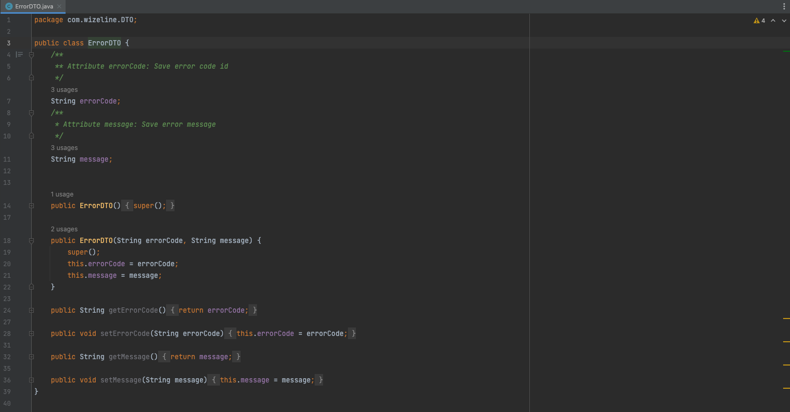

# Java
Recursos y pasos importantes para el curso

# :computer:  Actividades

## Pre-requisitos de la sesión en vivo :exclamation:

Para realizar este curso es importante tener instalado los siguientes programas::
* [JDK 11](https://www.oracle.com/java/technologies/downloads/)
* [Intellij Idea Community](https://www.jetbrains.com/idea/download/#section=windows)


## Java línea de comando
Una vez que JDK y Intellij fue descargados e instalados, procederemos a validar que este bien instalado para comenzar las pruebas

### PASO 1: Validar entorno
Abrimos una terminal y validamos si reconoce nuestra versión de Java:

``` bash
# Iniciamos validando que nuestra consola reconosca la versión de Java

jonathan.torres@Jonathans-MacBook-Pro LearningJava1.2 % java -version
java version "11.0.15" 2022-04-19 LTS
Java(TM) SE Runtime Environment 18.9 (build 11.0.15+8-LTS-149)
Java HotSpot(TM) 64-Bit Server VM 18.9 (build 11.0.15+8-LTS-149, mixed mode)

```


## Temario Día 1

### Clases

Conceptos de clases y estructura.

### Herencia

Definición e implementación de herencia.

### Sobrecarga de métodos

Función e implementación de métodos sobrecargados.

### Sobrecarga de constructores

Función e implementación de constructores sobrecargados.


## Temario Día 2

### Encapsulamiento

Conceptos e implementación de encapsulamiento.

### Clases Internas

Definición e implementación de encapsulamiento.

### Paquetes

Función e implementación de paquetes.

### Interfaces

Función e implementación de interfaces.


## Practica
La practica y ejercicios las podemos encontrar en el directorio de practica





# :books: Para aprender mas
* [Java:] (https://dev.java)
* [Java Documentation:] (https://docs.oracle.com/en/java/)
* [Learn Java:] (https://dev.java/learn/)
* [Frequently Asked Questions (FAQs):] (https://dev.java/learn/faq/)
* [Java Youtube:] (https://www.youtube.com/java)
* [JRE/JDK:] (https://www.oracle.com/java/technologies/javase-downloads.html)
